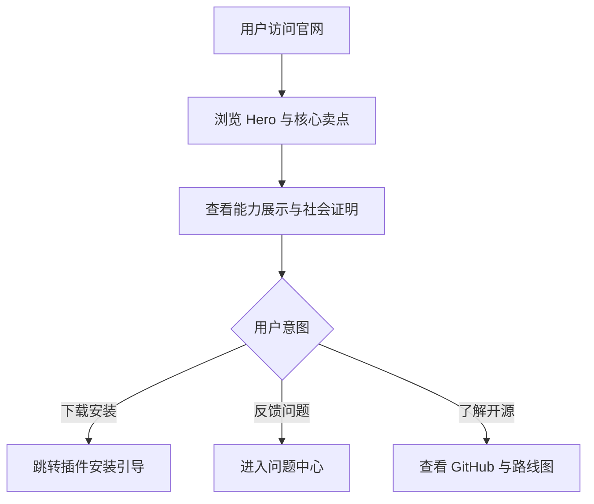
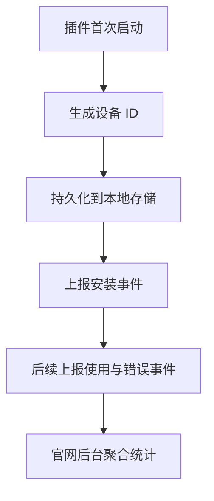
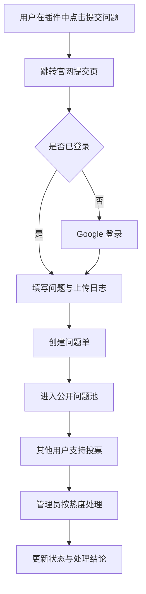

## 1. 产品概述

CCWebAI 官网是面向全球用户的增长型官网与运营中台，一方面承担插件下载、价值传达、开源品牌建设，另一方面承接安装统计、使用分析、问题反馈与支持投票。

* 目标用户：对多平台 AI 聚合接入感兴趣的个人用户、开发者、重度 AI 使用者、后续开源社区贡献者

* 核心价值：用强营销力的官网提升安装转化，用数据后台提升产品迭代效率，用问题中心建立用户反馈闭环

* 产品定位：免费、开源导向、科技感强、具备运营和问题治理能力的官网系统

## 2. 核心功能

### 2.1 用户角色

| 角色   | 注册方式                | 核心权限                                 |
| ---- | ------------------- | ------------------------------------ |
| 游客   | 无需注册                | 浏览官网、查看能力介绍、下载安装插件、查看公开问题列表与投票榜单     |
| 登录用户 | Google 登录           | 提交问题、上传相关日志、为问题投票、查看本人提交记录           |
| 管理员  | 后台账号白名单 + Google 登录 | 查看安装与使用统计、地区分布、问题池、支持度排序、问题处理状态、日志明细 |

### 2.2 功能模块

1. **官网落地页**：高科技感 Hero、产品价值叙事、平台兼容展示、安装引导、开源预告、常见问题、转化 CTA
2. **数据概览后台**：安装趋势、活跃设备趋势、请求量趋势、平台分布、地区分布、版本分布
3. **问题中心**：问题提交、日志上传、问题状态流转、支持投票、优先级排序、问题详情
4. **插件数据上报入口**：设备 ID 生成、匿名安装上报、使用行为上报、问题跳转链接生成
5. **认证与权限**：Google 登录、用户资料初始化、管理员权限控制

### 2.3 页面详情

| 页面名称                          | 模块名称      | 功能描述                                           |
| ----------------------------- | --------- | ---------------------------------------------- |
| 官网首页 `/`                      | Hero 首屏   | 展示 CCWebAI 核心价值、AI 科技感视觉、下载按钮、GitHub 仓库入口、开源声明 |
| 官网首页 `/`                      | 能力展示区     | 展示插件支持的平台、统一 OpenAI 风格入口、多轮会话、日志与诊断能力          |
| 官网首页 `/`                      | 社会证明区     | 展示安装数、请求量、问题解决率、地区覆盖等指标卡                       |
| 官网首页 `/`                      | 开源路线图区    | 展示当前阶段、开源计划、里程碑、贡献方向                           |
| 官网首页 `/`                      | CTA 转化区   | 下载插件、进入问题中心、查看支持榜单、关注开源                        |
| 问题中心 `/issues`                | 问题列表      | 按热度、最新、状态筛选问题，支持查看投票数与处理进度                     |
| 问题详情 `/issues/[id]`           | 问题详情      | 展示问题描述、附件日志、支持数、状态、管理员备注                       |
| 提交问题 `/issues/new`            | 提交表单      | 登录后提交问题标题、描述、插件版本、平台、日志附件、复现步骤                 |
| 用户中心 `/me/issues`             | 我的问题      | 查看本人提交的问题、支持记录、状态变化                            |
| 后台首页 `/admin`                 | 总览面板      | 展示安装总量、日活设备、请求总量、地区热力、版本分布                     |
| 后台安装分析 `/admin/installations` | 安装分析      | 按天/周/月查看安装量、去重设备数、来源渠道、版本趋势                    |
| 后台使用分析 `/admin/usage`         | 使用分析      | 查看请求量、平台调用占比、活跃设备、峰值时段、错误趋势                    |
| 后台地区分析 `/admin/regions`       | 地区分布      | 查看国家/地区分布、地图或排行列表、时区与语言偏好                      |
| 后台问题治理 `/admin/issues`        | 问题处理台     | 按热度/状态排序问题，处理、标记、关闭、添加备注                       |
| 登录页 `/login`                  | Google 登录 | 统一进入 Google OAuth 登录并返回问题中心或后台                 |

## 3. 核心流程

### 3.1 官网转化流程

用户进入官网后，先被高视觉冲击的首屏与核心卖点吸引，再通过能力展示和社会证明建立信任，最后通过下载插件或进入问题中心形成转化。

### 3.2 插件匿名上报流程

插件无需登录。首次安装时生成稳定设备 ID，后续在安装、启动、请求、错误、问题跳转等事件中带上该 ID，上报到官网后台用于统计与分析。

### 3.3 问题提交与处理流程

用户在插件中点击“提交问题”后跳转官网问题页面。若未登录，先走 Google 登录；登录后填写问题和日志。问题进入问题池后，其他用户可支持投票，管理员按热度和状态处理。

## 4. 用户界面设计

### 4.1 设计风格

* 整体风格：深色系 AI 科技视觉 + 高对比荧光点缀 + 大量动态光效与粒子感

* 设计关键词：未来感、速度感、系统监控感、全球化、强转化、非模板化

* 主色：近黑蓝、深空灰

* 辅色：电青、冷紫、荧光蓝、警示橙

* 按钮风格：大尺寸高发光 CTA、玻璃拟态与描边混合、悬浮时有能量流动感

* 字体建议：标题使用有科技感的展示字体，正文使用清晰的现代无衬线，避免通用感过强的默认字体

* 布局风格：桌面优先的大幅横向叙事布局，穿插不对称面板、数据 HUD、光栅背景、滚动驱动分层动画

* 图标建议：线性科技图标、网格、雷达扫描、节点网络、地球与数据链路元素

### 4.2 页面设计概览

| 页面名称  | 模块名称    | UI 元素                            |
| ----- | ------- | -------------------------------- |
| 官网首页  | Hero 首屏 | 全屏动态背景、发光网格、粒子流、品牌宣言、强 CTA、滚动指示器 |
| 官网首页  | 能力展示区   | 悬浮卡片、平台徽章墙、连接线路动画、数据流效果          |
| 官网首页  | 社会证明区   | 动态计数器、趋势曲线、小型数据图、滚动数字翻牌效果        |
| 官网首页  | 开源路线图区  | 时间轴、阶段节点、发光描边、未来版本规划卡片           |
| 官网首页  | CTA 区   | 大型按钮、二级跳转入口、局部视差与 hover 动效       |
| 问题中心  | 列表区     | 多条件筛选、热度标签、状态标签、支持按钮、分页或无限滚动     |
| 提交问题页 | 表单区     | 分步表单、日志拖拽上传、平台选择器、版本输入、成功反馈      |
| 管理后台  | 数据概览    | 仪表盘 KPI 卡片、折线图、柱状图、地图或地区排行、版本分布图 |
| 管理后台  | 问题治理台   | 表格 + 详情抽屉、状态切换、热度排序、备注时间线        |

### 4.3 响应式策略

* 采用桌面优先设计

* 平板端保持核心叙事与图表可读性

* 移动端保留官网主转化链路、问题提交与基础浏览能力

* 动画在低性能设备上按层级降级，避免首屏卡顿

### 4.4 动效与品牌体验指导

* 首屏需要有高识别度的品牌入场动画，避免常见 SaaS 模板感

* 滚动过程需有明显的层次切换、信息揭示与视差感

* 数据区块与图表区要体现“真实产品正在运行”的系统氛围

* 问题中心与后台应转为更专业的运维/工单视觉，减少营销噪音

