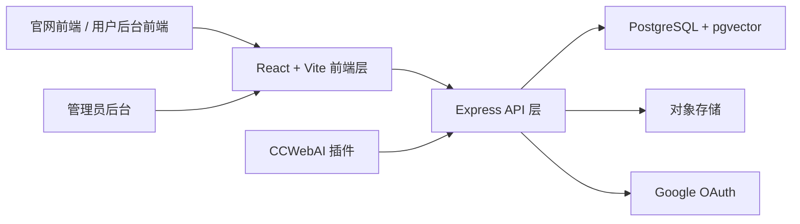
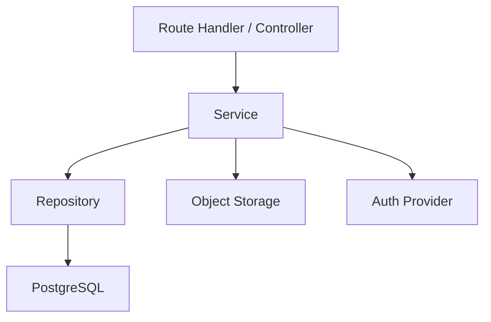
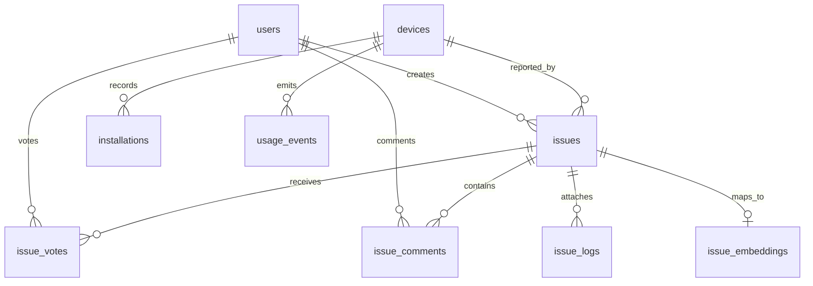

## 1. 架构设计

官网与后台采用一个统一的 Web 应用承载：前台负责品牌展示与转化，后台负责运营数据与问题治理；插件通过匿名设备 ID 向服务端上报安装与使用事件，底层使用 PostgreSQL 与 `ankane/pgvector` 承载业务数据和后续语义检索能力。



## 2. 技术说明

- 前端与服务端一体化：React + Vite + TypeScript + Express
- UI：Tailwind CSS + 自定义设计系统 + 图表组件
- 认证：Google OAuth 登录
- 数据库：PostgreSQL（远程实例）+ `ankane/pgvector`
- 文件存储：对象存储，用于日志附件上传
- 数据可视化：图表库 + 地区分布可视化组件
- 初始化方式：React + Express TypeScript 脚手架

### 2.1 技术取舍

- 采用 React + Express 而不是纯静态站点：因为官网、问题中心、后台、登录与 API 都需要统一承载
- 插件保持匿名：不要求插件登录，降低使用门槛
- 官网登录只用于问题治理：减少业务路径耦合
- 使用设备 ID 作为匿名统计主键：满足安装量、活跃度、地区分布、版本分布等统计需求
- 使用 pgvector 为问题文本、日志摘要、后续相似问题推荐与聚类分析预留能力

## 3. 路由定义

| 路由 | 作用 |
|------|------|
| `/` | 官网首页，承担产品介绍、下载转化、开源预告、问题入口 |
| `/login` | Google 登录入口与回调承接页 |
| `/issues` | 公开问题列表与支持榜单 |
| `/issues/new` | 登录后提交问题 |
| `/issues/[id]` | 问题详情页 |
| `/me/issues` | 当前用户的问题与支持记录 |
| `/admin` | 后台总览页 |
| `/admin/installations` | 安装分析页 |
| `/admin/usage` | 使用分析页 |
| `/admin/regions` | 地区分析页 |
| `/admin/issues` | 问题处理页 |

## 4. API 定义

### 4.1 认证相关

```ts
type LoginResult = {
  ok: boolean;
  user?: {
    id: string;
    email: string;
    name: string;
    avatarUrl?: string;
    role: "user" | "admin";
  };
};
```

### 4.2 插件匿名上报

#### `POST /api/telemetry/install`

```ts
type InstallEventRequest = {
  deviceId: string;
  extensionVersion: string;
  browser: string;
  language: string;
  timezone?: string;
  installedAt: string;
  source?: "website" | "manual" | "unknown";
};

type InstallEventResponse = {
  ok: boolean;
  installId: string;
};
```

#### `POST /api/telemetry/usage`

```ts
type UsageEventRequest = {
  deviceId: string;
  extensionVersion: string;
  eventType:
    | "extension_opened"
    | "request_started"
    | "request_succeeded"
    | "request_failed"
    | "issue_entry_clicked";
  providerId?: string;
  model?: string;
  region?: string;
  metadata?: Record<string, unknown>;
  occurredAt: string;
};

type UsageEventResponse = {
  ok: boolean;
};
```

### 4.3 问题反馈

#### `POST /api/issues`

```ts
type CreateIssueRequest = {
  title: string;
  description: string;
  providerId?: string;
  extensionVersion?: string;
  deviceId?: string;
  reproductionSteps?: string;
  logFileIds?: string[];
};

type CreateIssueResponse = {
  ok: boolean;
  issueId: string;
};
```

#### `POST /api/issues/[id]/vote`

```ts
type VoteIssueRequest = {
  value: 1;
};

type VoteIssueResponse = {
  ok: boolean;
  totalVotes: number;
};
```

#### `POST /api/uploads/logs`

```ts
type UploadLogResponse = {
  ok: boolean;
  fileId: string;
  fileName: string;
  size: number;
};
```

### 4.4 后台数据接口

#### `GET /api/admin/overview`

```ts
type AdminOverviewResponse = {
  ok: boolean;
  metrics: {
    totalInstalls: number;
    activeDevices7d: number;
    requests7d: number;
    openIssues: number;
    resolvedIssues: number;
  };
  installTrend: Array<{ date: string; value: number }>;
  usageTrend: Array<{ date: string; value: number }>;
  providerBreakdown: Array<{ providerId: string; value: number }>;
  regionBreakdown: Array<{ region: string; value: number }>;
  versionBreakdown: Array<{ version: string; value: number }>;
};
```

## 5. 服务端架构图



## 6. 数据模型

### 6.1 数据模型定义



### 6.2 数据定义语言

```sql
create table users (
  id uuid primary key,
  email text not null unique,
  name text not null,
  avatar_url text,
  role text not null default 'user',
  created_at timestamptz not null default now()
);

create table devices (
  id uuid primary key,
  device_id text not null unique,
  first_seen_at timestamptz not null default now(),
  last_seen_at timestamptz not null default now(),
  first_language text,
  first_timezone text,
  latest_extension_version text,
  latest_region text
);

create table installations (
  id uuid primary key,
  device_id uuid not null references devices(id) on delete cascade,
  extension_version text not null,
  browser text,
  language text,
  timezone text,
  source text default 'unknown',
  installed_at timestamptz not null,
  created_at timestamptz not null default now()
);

create index idx_installations_device_id on installations(device_id);
create index idx_installations_installed_at on installations(installed_at desc);

create table usage_events (
  id uuid primary key,
  device_id uuid not null references devices(id) on delete cascade,
  event_type text not null,
  provider_id text,
  model text,
  extension_version text,
  region text,
  metadata jsonb not null default '{}'::jsonb,
  occurred_at timestamptz not null,
  created_at timestamptz not null default now()
);

create index idx_usage_events_device_id on usage_events(device_id);
create index idx_usage_events_occurred_at on usage_events(occurred_at desc);
create index idx_usage_events_event_type on usage_events(event_type);

create table issues (
  id uuid primary key,
  user_id uuid references users(id) on delete set null,
  device_id uuid references devices(id) on delete set null,
  title text not null,
  description text not null,
  provider_id text,
  extension_version text,
  reproduction_steps text,
  status text not null default 'open',
  priority_score integer not null default 0,
  admin_note text,
  created_at timestamptz not null default now(),
  updated_at timestamptz not null default now()
);

create index idx_issues_status on issues(status);
create index idx_issues_priority_score on issues(priority_score desc);
create index idx_issues_created_at on issues(created_at desc);

create table issue_votes (
  id uuid primary key,
  issue_id uuid not null references issues(id) on delete cascade,
  user_id uuid not null references users(id) on delete cascade,
  created_at timestamptz not null default now(),
  unique(issue_id, user_id)
);

create table issue_comments (
  id uuid primary key,
  issue_id uuid not null references issues(id) on delete cascade,
  user_id uuid not null references users(id) on delete cascade,
  content text not null,
  created_at timestamptz not null default now()
);

create table issue_logs (
  id uuid primary key,
  issue_id uuid not null references issues(id) on delete cascade,
  file_name text not null,
  file_path text not null,
  file_size bigint not null default 0,
  created_at timestamptz not null default now()
);

create table issue_embeddings (
  issue_id uuid primary key references issues(id) on delete cascade,
  embedding vector(1536),
  model text,
  updated_at timestamptz not null default now()
);
```

## 7. 关键实现约束

- 插件端不登录，只生成并持久化匿名 `deviceId`
- `deviceId` 仅用于匿名统计与问题关联，不直接展示为用户身份
- 后台页面必须做管理员权限校验，普通用户不可访问
- 问题提交页必须要求登录，插件端点击“提交问题”仅负责跳转
- 数据统计默认按去重设备、时间窗口、版本、地区、平台四个维度聚合
- 官网首页与后台共享同一设计语言，但后台降低营销装饰强度，强调可读性与效率
- 数据库连接使用环境变量注入，不在受版本控制文件中硬编码账号密码
